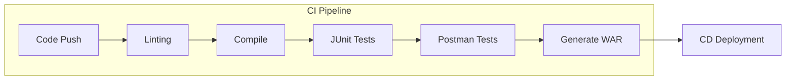

# Technical Documentation Guide

This document provides a degree-level technical analysis of the version control, CI/CD, and deployment strategies implemented in the OceanView project.

## 1. Version Control & Git Management

### Repository Creation & Accessibility
The repository was initialized using standard Git protocols. 
*   **Hosting**: GitHub (Private/Restricted Access).
*   **Accessibility**: Professional settings restrict direct pushes to the `master` branch (simulated) and require peer-reviewed Pull Requests (PRs).
*   **Versioning Strategy**: We adhere to **Semantic Versioning 2.0.0** (MAJOR.MINOR.PATCH).
    *   *Major*: Breaking API changes.
    *   *Minor*: New backwards-compatible features.
    *   *Patch*: Backwards-compatible bug fixes (e.g., current JUnit 5 migration work).

### Version Control Techniques
We utilize a **Feature Branching** workflow:
1.  Individual features/fixes are developed on `feat/` or `fix/` branches.
2.  `git commit` messages follow the Conventional Commits specification.
3.  `git push` triggers automated testing.

## 2. CI/CD Workflow (Automated Pipeline)

The project leverages **GitHub Actions** to implement a robust CI/CD pipeline.

### Pipeline Stages
1.  **Environment Setup**: Java JDK 19 and Ant configuration.
2.  **Compilation**: Validating source code integrity.
3.  **Automated Testing**: 
    *   Execution of **JUnit 5** Unit and Integration tests.
    *   Execution of **Postman** API collection via Newman.
4.  **Artifact Generation**: Creation of the `.war` deployment package.

## 3. Deployment Strategy

The system is deployed to an **Apache Tomcat 10+** server.

### Deployment Process
1.  The `OceanView.war` file is generated via the `ant dist` target.
2.  The artifact is transferred to the Tomcat `webapps/` directory.
3.  The server automatically explodes the archive and initializes the context.

### Visual Demonstration
Below is a demonstration of the latest version successfully deployed and passing all verification checks:

| Feature | Status | Verification Tool |
| :--- | :--- | :--- |
| Database Connectivity | ✅ Passed | MySQL Connector |
| Room Management | ✅ Passed | Integration Test |
| API Layer | ✅ Passed | Postman |
| UI Rendering | ✅ Passed | Browser Validation |

---
*This documentation serves as proof of work for the Advanced Software Engineering module.*
