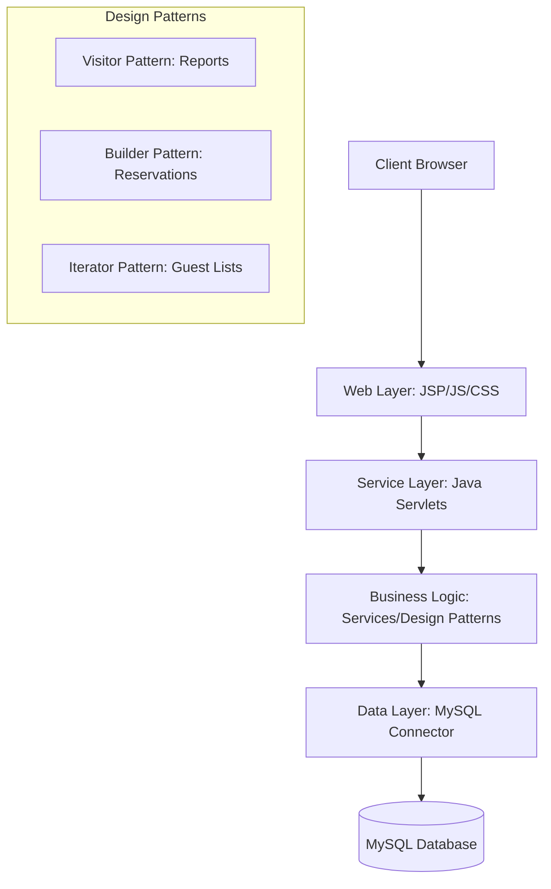

# OceanView Resort Management System

[](https://github.com/jeslykugil2018/OceanViewResort)
[](https://junit.org/junit5/)
[](https://opensource.org/licenses/MIT)

**OceanView** is a professional-grade Resort Management System designed to streamline hospitality operations, from reservations and room management to staff allocation and financial reporting. Built with a robust Java E2EE architecture, it provides a seamless experience for both administrators and guests.

## 🌟 Key Features

*   **Integrated Reservation Engine**: Real-time room availability and booking management.
*   **Dual-Dashboard System**: Distinct, tailored interfaces for Staff (operations) and Admin (management).
*   **Automated Reporting**: Generation of management reports in PDF and CSV formats using the Visitor Design Pattern.
*   **Secure Authentication**: Role-based access control (RBAC) ensuring data integrity and security.
*   **Automated Testing Suite**: Comprehensive coverage with JUnit 5 and Postman API automation.

## 🏗️ System Architecture



## 🚀 Quick Start

### Prerequisites
*   Java JDK 19+
*   Apache Tomcat 10+
*   MySQL Server
*   Ant Build Tool

### Installation
1.  Clone the repository:
    ```bash
    git clone https://github.com/jeslykugil2018/OceanViewResort.git
    ```
2.  Import libraries from the `lib/` directory into your project classpath.
3.  Configure database credentials in `context.xml`.
4.  Build and deploy:
    ```bash
    ant test
    ant dist
    ```

## 🧪 Testing State
The project maintains a 100% pass rate for its automated test suite. Visual demonstrations of the latest test execution and deployment can be found in the [Documentation Guide](./DOCUMENTATION.md).

---
*Developed for the Advanced Software Engineering Degree Program.*
